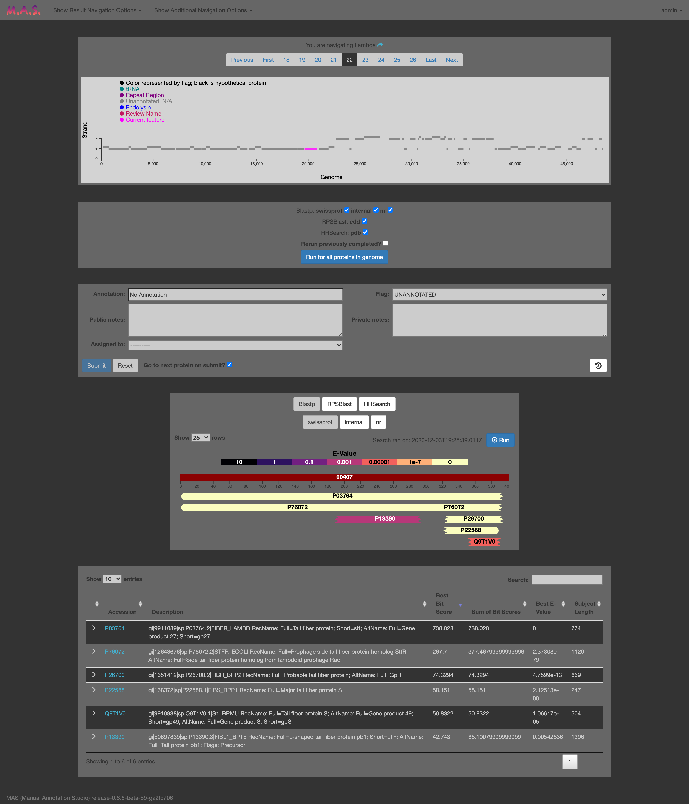
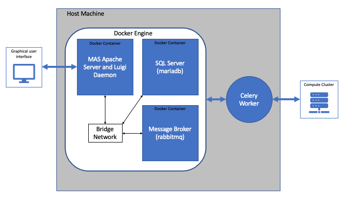

-----------------------------------------

Manual Annotation Studio (MAS) is a web server which assists users in the process of identifying coding regions and 
determining the function of genes. It does this by:
- Facilitating team efforts, allowing multiple users to work on the same data.
- Automatically performing gene finding when user uploads a genome.
- Allowing users to run a variety of homology search tools (BLAST, HHpred, CD-Search) against a variety of different 
databases with a simple point-and-click interface.
- Bringing search results from different tools/databases together so they can be easily compared an contrasted.
- Visualizing homology search results for easy interpretation.
- Saving search results, annotations, genomes, and metadata to structured database which can be queried.
- Providing and interface for users to easily search and filter through annotations and uploaded genomes.
- Allowing users to assign notes and a flag to each annotation to provide extra information about each protein.
- Keeping track of each annotation's history, including previous names, notes, flags, and which user made each edit.
- Allowing proteins to be searched against previously annotated proteins, facilitating the consistency of annotations 
in your database.
- Allowing you to set up accounts for other users and set their level of access.
- Allowing the assignment of proteins to a specific user for delegating annotation tasks.
- Allowing data to be output to a variety of file formats, such as fasta, genbank, excel, and GFF.
- Assisting in phage genome reorientation.
- Being able to run its homology search pipeline in an HPC cluster environment (SGE or SLURM), allowing it to efficiently handle a 
large number of searches simultaneously.
- Having the ability to run only on your local network, ensuring your data is private and secure.

### Publication

If you use MAS in your research, please cite:
>Lueder, M.R., Cer, R.Z., Patrick, M. et al. Manual Annotation Studio (MAS): a collaborative platform for manual functional annotation of viral and microbial genomes. BMC Genomics 22, 733 (2021). https://doi.org/10.1186/s12864-021-08029-8

### Disclaimer

The views, opinions, interpretations, conclusions, and recommendations expressed in this article reflect the results of research conducted by the authors and do not necessarily reflect the official policy or position of the Department of the Navy, Department of Defense, nor the United States Government.  

KBL is a federal employee of the United States government. This work was prepared as part of her official duties. Title 17 U.S.C. 105 provides that `copyright protection under this title is not available for any work of the United States Government.' Title 17 U.S.C. 101 defines a U.S. Government work as work prepared by a military service member or employee of the U.S. Government as part of that person's official duties.
This work was supported by WUNA1417, the Naval Research Enterprise Internship Program (NREIP), and by the Assistant Secretary of Defense for Health Affairs, through the Peer Reviewed Medical Research Program Focused Program Award, Log Number PR182667. 

### General Overview of MAS's Architecture

Successful installation of MAS requires the setup of multiple interacting components. Most of these components run in 
docker containers, making their installation relatively easy. However, this means you must first have 
[Docker](https://docs.docker.com/get-docker/) installed on the host machine. With Docker installed, creation 
of the images and containers needed to run MAS is facilitated through the 
[docker-compose command](https://docs.docker.com/compose/). MAS makes use of 3 docker containers: one container runs the 
Apache server and luigi daemon, one which runs the mariadb SQL server, and one which runs the message broker used 
to facilitate communication between the Apache server and its Celery worker. By default, these 3 docker containers are 
run by the same docker engine and communicate over a bridge network. The Celery worker is the final component.
The Apache server outsources time consuming/computationally intensive tasks to it. It runs directly on the host machine,
allowing it to communicate with job schedulers (SGE or SLURM) which can distribute tasks to a HPC cluster. While this option
is available to those who have the infrastructure, it is not a requirement. All of MAS's components can run on a single 
machine. Dependencies for the Celery worker can be installed the 
[conda package management system](https://docs.conda.io/projects/conda/en/latest/). 

## Installation

#### 1) Installing Docker and Conda

To install MAS, Docker and Conda must first be installed on the host machine. Install Docker 
[here](https://docs.docker.com/get-docker/). Conda can be installed through miniconda which can be acquired 
[here](https://docs.conda.io/en/latest/miniconda.html).

#### 2) Downloading Required Databases
Each tool searches against a database or multiple databases. With the exception of the internal blast database (which is
generated automatically by the MAS server), these databases are publicly available and must be downloaded. A few of these 
databases are **very** large and downloading them will take a significant amount of time (depending on network bandwidth).
These databases are also continuously being revised and updated with additional data and it is your responsibility to keep
them up to date. 

* **NCBI's nr database [BLAST]** \
This is a massive protein database which includes non-redundant sequences from GenBank and other sources. It's immense 
size means that it is more likely to contain a protein homologous to the query sequence than other data sources, however
it also means the annotations for sequences in this database are less reliable than the other databases used by MAS. 
Because of this, it is advised to use caution when interpreting nr search results. The easiest way to download nr
is with the update_blastdb.pl tool (this tool will be available after installing BLAST from conda). Find details on
how to run it *[here](https://www.ncbi.nlm.nih.gov/books/NBK537770/)*. The database files are also available via 
[FTP](https://ftp.ncbi.nlm.nih.gov/blast/db/). This download will be about 90 Gb but will take up significantly more
disk space after it is decompressed (~230 Gb).

* **SwissProt [BLAST]** \
SwissProt is a highly curated database of manually annotated proteins. SwissProt is a smaller database but each annotation
in it is reviewed. The latest version of SwissProt can be downloaded 
[here](ftp://ftp.uniprot.org/pub/databases/uniprot/current_release/knowledgebase/complete/uniprot_sprot.fasta.gz). This 
link will download a fasta file which will need to be converted a BLAST database using the 
[makeblastdb](https://www.ncbi.nlm.nih.gov/books/NBK279688/) command.

* **The Conserved Domain Database (CDD) [rpsblast]** \
The CDD is a NCBI curated database which contains models of protein domains. Searching it with rpsblast can help you 
identify functional domains in your query sequence. It can be downloaded via 
[FTP](https://ftp.ncbi.nih.gov/pub/mmdb/cdd/cdd.tar.gz).

* **Uniclust [HHblits]** \
HHblits runs as a preliminary step to HHsearch. It builds the multiple sequence alignment needed as input by 
HHSearch. It requires the Uniclust30 which contains UniProtKB sequences clustered at 30% pairwise sequence identity.
The latest Uniclust can be downloaded [here](http://gwdu111.gwdg.de/~compbiol/uniclust/current_release/).

* **Protein Data Bank (PDB) [HHsearch]** \
The PDB is a database proteins which have had their 3D structures resolved. HHsearch searches PDB for proteins with 
similar secondary structure to the query sequence. Download the required data 
[here](http://wwwuser.gwdg.de/~compbiol/data/hhsuite/databases/hhsuite_dbs/pdb70_from_mmcif_latest.tar.gz).

#### 3) Configuration

The Docker containers and the Celery worker must be configured before installation. The docker containers are configured 
with the .env file and the Celery worker is configured with the AnnotationToolPipeline/luigi.cfg file. These settings 
will be copied into the Docker containers when they are created, so if you need to change the settings after completing 
the installation process you should rebuild the containers. 

##### Configuring the .env file

This file contains variables which you need to set. Because this file contains sensitive information, adjust the permissions to
ensure other users can not access it (chmod go-rwx .env).

    - MYSQL_ROOT_PASSWORD: This is the password used to connect to the SQL database.
    - ADMIN_USER_PASSWORD: The password to the default administrative user. You will use this account to create other users.
    - LUIGI_USER_PASSWORD: The password to the luigi user. This account is used by the celery worker to submit job results 
        back to the server through a REST API. You will not need to log in as this user.
    - RABBITMQ_DEFAULT_PASS: The password used for communicating with the message broker.
    - ALLOWED_HOST: The name of the host machine. This will be added to the ALLOWED_HOSTS configuration in production mode. 
        This is necessary if users will access MAS over a local area network. For more information see 
        https://docs.djangoproject.com/en/3.1/ref/settings/#allowed-hosts
    - DEVELOPER_MODE: Always have this set to FALSE for production. MAS will print out degugging info when this is set to TRUE.
    - MAS_WORKER_PID_FILE: The full path to the pid file which will be used by the mas-worker
    - MAS_WORKER_LOG: Full path to log that mas-worker will use
    - CONDA_EXE: Full path to conda executable. This will be in your environment after installing conda, however you need
        to explicitly define it in order to daemonize the mas-worker.

##### Configuring luigi.cfg

There are 16 required variables which need to be set. Database paths should be the full path to the database files minus the extension.
Databases must be located so that they can be accessed by the Celery worker and any SGE/SLURM task. 

    Globals:
    
    - OUTPUT_DIR: (full path) Location where the Celery worker deposits pipeline output. You will not need to directly interact with 
    this output unless you want to check task log files. If you are running on a cluster, this path must be accessible to all nodes.
    - ERROR_LOG: (full path) Luigi will output errors to this log. Specifics of errors can be found in per-task logs in the output dir.
    - NUM_WORKERS: (int) The number of luigi workers to start up when a celery worker starts a luigi pipeline. 
    - CLUSTER: (False, SGE, or SLURM) The job scheduling software to use. Can be set to False if SGE and SLURM are not available,
    however it is recommended to use a job scheduler even in a single node set-up because it will manage resources better.
    
    Blastp: 
    
    - swissprot: (full path) Full path to swissprot BLAST database.
    - nr: (full path) Full path to nr BLAST database.
    - internal: (full path) Full path to internal BLAST database. This database will not exist until MAS is ran. It will be 
    generated automatically when new data is added or changed through the GUI. You should set the path + database file name 
    here. The directory the database will reside in must exist and the Celery worker must have write permissions to it. 
    - swissprot_cpu: (int) Number of threads to use when blasting against swissprot
    - nr_cpu: (int) Number of threads to use when blasting against nr
    - internal_cpu: (int) Number of threads to use when blasting against the internal db
    
    RRPSBlast:
    
    - cdd: (full path) Full path to rpsblast CDD database.
    - cdd_cpu: (int) Number of threads to use when using rpsblast
    
    HHblits:
    
    - uniclust: (full path) Full path to uniclust database.
    - uniclust_cpu: (int) Number of threads to use when using HHblits
    
    HHsearch:
    
    - pdb: (full path) Full path to PDB database.
    - pdb_cpu: (int) Number of threads to use when running HHsearch

#### 4) Building Docker Images and Containers

After configuration, a single command can be used to build all required docker images and to create and start all 3 required docker 
containers. 

    docker-compose up
    
Run this command is the same directory as this file. After running this, the docker containers will start automatically when the host 
machine restarts. You should now be able to access MAS by typing 0.0.0.0:8080 in a web browser. However, you need to complete the setup
 to upload genomes or run searches.

If you would like to reconfigure and rebuild the docker containers after running the above command run:

    docker-compose up --build 
    
Note: The MAS database is stored in a Docker volume and will persist when rebuilding images. This means the MYSQL_ROOT_PASSWORD configuration 
will not be updated unless you delete the volume containing the database ('docker volume rm mas_db-data' THIS WILL DELETE ALL UPLOADED DATA).
If you wish to change the MySQL password after building without deleting the volume, you can rebuild you images with the new MYSQL_ROOT_PASSWORD
configuration set then manually change the password by entering the sql server container ('docker exec -it mas-sql-server') and changing it 
through the terminal.

#### 5) Installing and Running the Celery Worker

The Celery worker facilitates the heavy lifting for MAS; Either by doing it itself (when CLUSTER=False) or by delegating it through job
scheduling software (CLUSTER=SGE or CLUSTER=SLURM). Because it runs on directly the host, it can not be installed with docker-compose.
Installation of dependencies are handled through the Conda and pip package management systems. To create a conda environment and 
download dependencies, run the install-worker script.

    ./install-worker.sh

This will create the 'mas-worker' conda environment. After running the install script, you can start, stop, and restart 
the worker by running the mas-worker script.

    ./mas-worker.sh start
    ./mas-worker.sh stop
    ./mas-worker.sh restart
    

#### 6) Creating Users and Setting Permissions

If you completed steps 1-5 and started the worker, MAS should be functional. You can now log into the admin account using the password you provided in the 
.env file. If you would like to add new users, you can do so through the admin interface. When you are logged as admin navigate to the admin interface
by adding /admin/ to the site's domain. If you are accessing the site locally you would use the address http://0.0.0.0:8080/admin/. If you are running 
on a named server you can replace 0.0.0.0 with the server's name (what you set as ALLOWED_HOST). Then, click on 'Users' and add new ones by selecting 
add user at the top right. You must set an initial password but this can be changed by the intended user of the account later.

After entering a username and password you will be taken to another page where you can enter various other information to be associated with
the account. The important thing here is to decide on the user's level of access. Anyone with an account can view data on MAS. However, in 
order to edit data and upload new genomes, the user must be a part of the **data editors** group. If you would like to give the account this
permission, add Data Editors to chosen groups.

#### 7) Backing up the Database

The SQL server uses the docker volume *mas_db-data* to store its data. This will contain all genomes and annotations uploaded to MAS. 
It is highly recommended to back this up. This can be done using the 'docker run' command. 

    docker exec mas-sql-server sh -c 'exec mysqldump -uroot -p"$MYSQL_ROOT_PASSWORD" mas' > /path/to/your/backup_dir/mas-db-backup.sql

Just replace '/path/to/your/backup_dir' with the desired destination of the backup file.

Search results are stored as text files and will not be present in the mas_db-data volume. The are found in the *mas_masmedia* volume. It is also 
recommended that you back the media volume up. You should do this immediately **after** backing up the SQL database. This is because the SQL database
contains links to files in the media directory. If the sql database backup is newer than the media backup, there is a chance that there will be broken
links when you restore the database. Pages trying to load the broken link to crash.

    docker exec -w /home/daemon/MAS -u daemon mas sh -c 'tar -czkO media' > /path/to/your/backup_dir/mas-media-backup.tar.gz

To restore from a back up use the following commands (current data will be overwritten) :

    docker exec -i mas-sql-server sh -c 'exec mysql -uroot -p"$MYSQL_ROOT_PASSWORD" mas' < /path/to/your/backup_dir/mas-db-backup.sql
    docker exec -i -u daemon mas /bin/bash -c 'rm -rf /home/daemon/MAS/media ; tar -C /home/daemon/MAS -xz <&0' < /path/to/your/backup_dir/mas-media-backup.tar.gz

#### 8) Daemonizing the Worker

MAS depends on a running worker to function. In order to ensure that the MAS worker runs continually, you must install it on the host 
machine as a daemon. If your computer uses systemd you can do this by modifying the the provided mas-worker.service file:
 1. Replace bracketed instructions (including the brackets) in mas-worker.service with data specific to your setup. 
 2. Place the file in /etc/systemd/system
 3. Run run `systemctl daemon-reload` so the system recognizes the file you added.
 4. Run `systemctl enable mas-worker.service` so the worker will start on reboot.
 5. Run `systemctl start mas-worker.service` to start the worker immediately.
